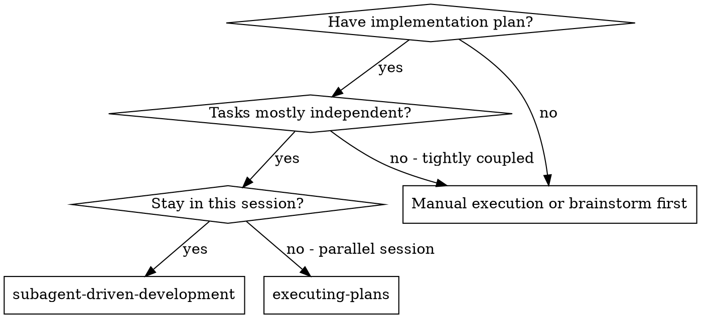
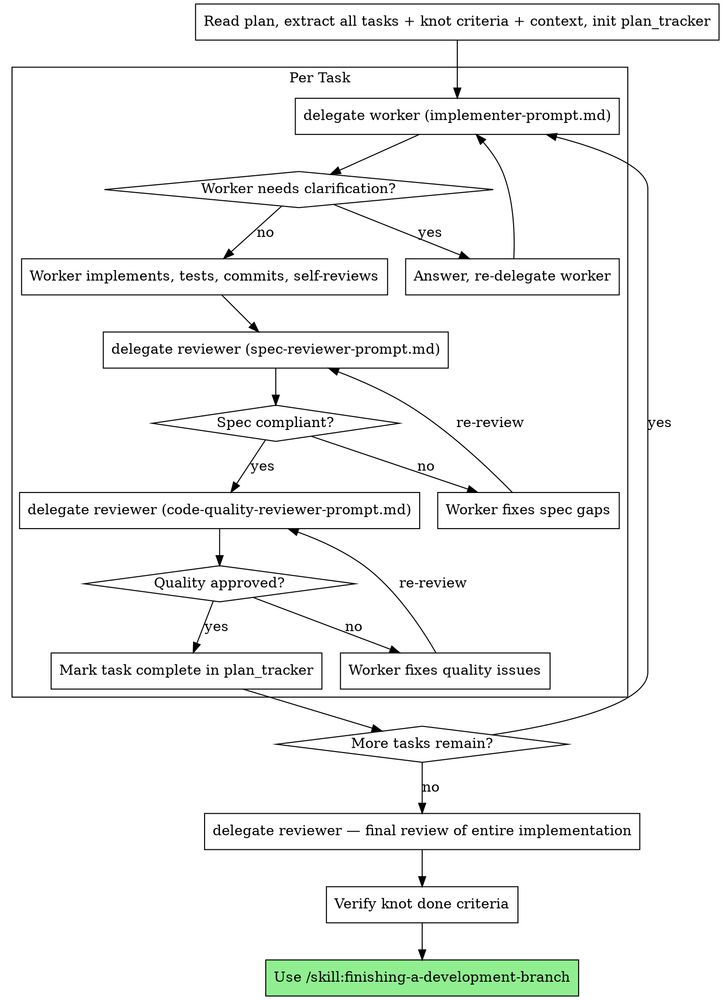

> **Related skills:** `/skill:frs-strategy` for knot context that must be passed to every teammate. `/skill:verification-before-completion` for knot done-criteria verification after all tasks complete.

# Teammate-Driven Development

Execute a plan by delegating each task to the `worker` teammate, then running two-stage review with the `reviewer` teammate: spec compliance first, then code quality.

**Why delegation:** You delegate tasks to specialized teammates with isolated context. By precisely crafting their task briefs, you ensure they stay focused and succeed. Teammates never inherit your session's context — you construct exactly what they need. This preserves your own context for coordination.

**Core principle:** Fresh `worker` per task + two-stage `reviewer` (spec then quality) = high quality, fast iteration.

**Continuous execution:** Do not pause to check in between tasks. Execute all tasks from the plan without stopping. The only reasons to stop are: BLOCKED status you cannot resolve, genuine ambiguity, or all tasks complete.

## When to Use



## The Process



## How to Delegate

Use the `delegate` tool. All teammates get `context: "new"` — you provide everything they need in the task brief. Never use `context: "inherit"`.

**Worker (implementation):**
```
delegate:
  teammate: "worker"
  context: "new"
  cwd: "/path/to/project"
  task: "[full brief from implementer-prompt.md]"
```

**Reviewer (spec or quality):**
```
delegate:
  teammate: "reviewer"
  context: "new"
  cwd: "/path/to/project"
  task: "[full brief from spec-reviewer-prompt.md or code-quality-reviewer-prompt.md]"
```

**Re-delegation (fix gaps):** Re-delegate the same teammate role with a new task brief that includes:
- What the previous review found
- What needs to be fixed specifically
- The original task requirements (still in full)

## Handling Worker Status

Workers report one of four statuses:

**DONE:** Proceed to spec compliance review.

**DONE_WITH_CONCERNS:** Worker completed but flagged doubts. Read them. If they concern correctness or scope, address before review. If they're observations, note and proceed.

**NEEDS_CONTEXT:** Worker needs information not provided. Provide it and re-delegate.

**BLOCKED:** Worker cannot complete the task. Assess:
1. Context problem → provide more context, re-delegate
2. Task too large → break into smaller pieces, re-delegate
3. Plan is wrong → escalate to user

**Never** force a retry without changes. If the worker is stuck, something must change.

## Task Briefs

- `./implementer-prompt.md` — Worker task brief template
- `./spec-reviewer-prompt.md` — Spec compliance reviewer task brief
- `./code-quality-reviewer-prompt.md` — Code quality reviewer task brief

## Example Workflow

```
[Read plan: docs/superpowers/plans/feature-plan.md]
[Extract all 5 tasks + FRS context + knot criteria]
[Init plan_tracker with all tasks]

Task 1: Hook installation script

[delegate worker with full task 1 brief + FRS context]
Worker: "Before I begin — should the hook be installed at user or system level?"
You: "User level (~/.config/edgeos/hooks/)"
[re-delegate worker with clarification]
Worker: DONE — implemented + 5/5 tests passing + committed

[delegate reviewer — spec compliance brief for task 1]
Reviewer: ✅ Spec compliant — all requirements met

[delegate reviewer — quality brief for task 1, BASE_SHA..HEAD_SHA]
Reviewer: Approved. No issues.

[Mark Task 1 complete]

Task 2: Recovery modes

[delegate worker with full task 2 brief + FRS context]
Worker: DONE — verify/repair modes + 8/8 tests passing + committed

[delegate reviewer — spec compliance]
Reviewer: ❌ Issues:
  - Missing: progress reporting (spec says "report every 100 items")
  - Extra: added --json flag (not requested)

[delegate worker with fix brief: remove --json, add progress reporting]
Worker: DONE — fixed both issues

[delegate reviewer — spec compliance re-review]
Reviewer: ✅ Spec compliant

[delegate reviewer — quality review]
Reviewer: Important: magic number (100) should be constant
[delegate worker — fix magic number]
Worker: DONE — extracted PROGRESS_INTERVAL constant
[delegate reviewer — quality re-review]
Reviewer: ✅ Approved

[Mark Task 2 complete]
...
[After all tasks: delegate reviewer for final full review]
[Verify knot done criteria with evidence]
[Use /skill:finishing-a-development-branch]
```

## Red Flags

**Never:**
- Start implementation on main/master branch without explicit user consent
- Skip reviews (spec compliance OR code quality)
- Proceed with unfixed issues
- Delegate multiple `worker` tasks in parallel (they may edit the same files)
- Make worker read the plan file — provide full text in the task brief
- Skip scene-setting context — worker needs to understand where the task fits
- Accept "close enough" on spec compliance
- Skip re-review after fixes
- **Start code quality review before spec compliance is ✅**
- Move to next task while either review has open issues
- **Skip knot done-criteria verification after all tasks complete**
- **Present finishing options without first verifying knot criteria**

**If worker reports BLOCKED:**
- Delegate a fix task to a new worker with specific instructions
- Do not try to fix manually (context pollution)

**If reviewer finds issues:**
- Delegate a fix task to a new worker with specific fix brief
- Re-delegate the same reviewer role after fix
- Repeat until approved

## Integration

**Required workflow skills:**
- **`/skill:using-git-worktrees`** — Ensures isolated workspace
- **`/skill:writing-plans`** — Creates the plan this skill executes
- **`/skill:requesting-code-review`** — Task brief templates for reviewer teammate
- **`/skill:finishing-a-development-branch`** — Complete development after all tasks

**Workers should use:**
- **`/skill:test-driven-development`** — Workers follow TDD for each task (knot-appropriate)

**Alternative workflow:**
- **`/skill:executing-plans`** — For in-session execution without delegation
